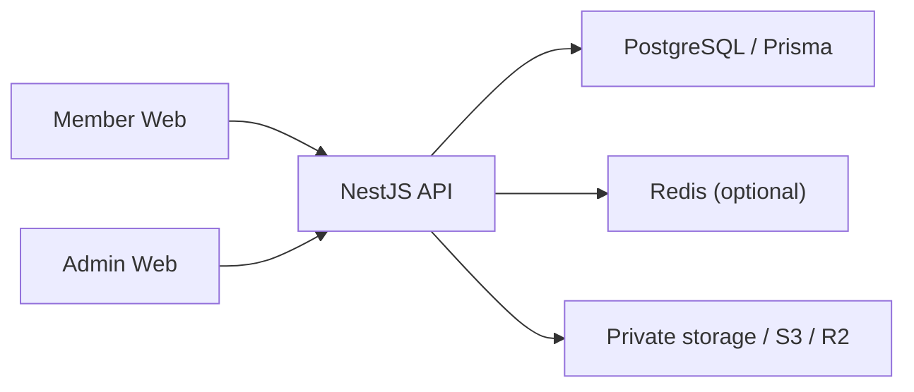

<div align="center">

# ✦ New Web Platform

### A secure, auditable operating platform for members, money flows, providers, and admin teams.

[](https://github.com/tawechok1997-ai/platform-starter/actions/workflows/build.yml)
[](https://github.com/tawechok1997-ai/platform-starter/actions/workflows/smoke.yml)
[](https://github.com/tawechok1997-ai/platform-starter/actions/workflows/e2e-smoke.yml)


<p>
  <a href="#-what-is-new-web-platform">Overview</a> ·
  <a href="#-capabilities">Capabilities</a> ·
  <a href="#-architecture">Architecture</a> ·
  <a href="#-quick-start">Quick start</a> ·
  <a href="#-project-status">Status</a>
</p>

<p><a href="README.th.md">🇹🇭 อ่านภาษาไทย</a></p>

</div>

---

## ✦ What is New Web Platform?

New Web Platform is a TypeScript monorepo with separate Member and Admin applications backed by a NestJS API and PostgreSQL database. The system is structured around auditable money operations, permission-aware administration, provider integration boundaries, responsive UX, and deployment verification.

The repository is currently in active product and UX/UI development. Core builds, API tests, authentication, wallet workflows, finance operations, and the responsive application shells are in place; provider production integrations and full visual regression coverage remain in progress.

## ✨ Highlights

| 💳 Money operations | 🛡️ Admin security | 🎨 Product UX |
| --- | --- | --- |
| Wallet and ledger foundation<br>Deposit and withdrawal queues<br>Idempotency and audit controls | Separate Admin auth<br>RBAC and permission guards<br>TOTP 2FA and recovery codes | Mobile-first Member app<br>Desktop Admin sidebar<br>Safe-area and focus support |

| 🎮 Provider boundary | 📈 Operations visibility | 🚦 Release controls |
| --- | --- | --- |
| Adapter contracts<br>Demo/simulator providers<br>Transfer recovery tooling | Reports and exports<br>Activity timeline<br>Risk and readiness panels | Health/version endpoints<br>Smoke scripts<br>Backup and restore tooling |

<details>
<summary><strong>Product surfaces at a glance</strong></summary>

| Surface | Purpose | Local URL |
| --- | --- | --- |
| Member Web | Member finance, games, profile, and support experience | `http://localhost:3000` |
| Admin Web | Back-office operations command center | `http://localhost:3001` |
| API | Auth, wallet, finance, provider, audit, and system APIs | `http://localhost:4000` |

</details>

## 🧭 Applications

| Application | Location | Responsibility |
| --- | --- | --- |
| Member Web | `apps/web-member` | Member authentication, wallet, deposits, withdrawals, games, promotions, profile, support, and history |
| Admin Web | `apps/web-admin` | Operations dashboard, queues, members, ledgers, reports, risk, providers, settings, and security |
| API | `apps/api` | Authentication, authorization, wallet, finance, reports, storage, provider boundaries, and auditability |
| Database | `prisma/schema.prisma` | PostgreSQL data model and Prisma client generation |

## Architecture



Both web applications share the API and business rules while keeping Member and Admin authentication, permissions, navigation, and operational responsibilities separate.

### Design principles

| Principle | Implementation |
| --- | --- |
| One business boundary | Money and authorization logic live in the API |
| Least privilege | Backend permission guards remain authoritative |
| Auditability | Sensitive Admin and money actions require traceability |
| Safe retries | Idempotency and state checks protect mutations |
| Responsive by intent | Device layouts can differ without duplicating business logic |
| Production gates | Real provider and real-money paths stay disabled until preflight and QA pass |

## 🧰 Technology

| Layer | Technology |
| --- | --- |
| Frontend | Next.js 14, React 18, TypeScript |
| Backend | NestJS, TypeScript |
| Database | PostgreSQL, Prisma 6 |
| Authentication | JWT access/refresh sessions, TOTP 2FA, recovery codes |
| Authorization | RBAC and permission guards |
| Storage | Private local storage or S3/R2-compatible object storage |
| Rate limiting | In-memory fallback with optional Redis support |
| Testing | Jest, Playwright smoke and visual configurations |
| CI/CD | GitHub Actions, Railway-ready services |

## ✨ Capabilities

### Member experience

- Responsive Member shell with mobile bottom navigation and desktop navigation.
- Member authentication, registration, session expiry, and anti-bot integration points.
- Wallet balance, deposit, slip upload, withdrawal, bank-account, and history flows.
- Game lobby, provider-aware launch boundaries, promotions, bonus, profile, notifications, and support surfaces.
- Thai-first labels and responsive layouts designed for mobile, tablet, and desktop.

### Admin operations

- Protected Admin authentication with refresh sessions and privileged 2FA enforcement.
- Permission-aware navigation and backend route authorization.
- Deposit and withdrawal review queues with claim/release and confirmation workflows.
- Member management, wallet and ledger inspection, finance reports, exports, risk alerts, and activity timeline.
- Provider setup, presets, credentials, endpoints, adapter testing, transfer recovery, webhook test mode, and reconciliation tooling.
- Admin security pages for sessions, roles, invitations, audit visibility, and recovery codes.

### Platform controls

- Ledger-based wallet operations with idempotency and audit requirements.
- Provider adapter boundary with demo and simulator implementations.
- Private slip/media storage with local and S3/R2-compatible drivers.
- Health/version endpoints, API smoke scripts, backups, restore scripts, and production environment checks.
- GitHub Actions workflows for builds, API smoke, E2E smoke, and visual checks.

## 📁 Repository layout

```text
apps/
  api/                 NestJS API
  web-admin/           Admin Next.js application
  web-member/          Member Next.js application
prisma/
  schema.prisma        PostgreSQL schema
  seed.ts              Base seed
  seed-access.ts       Roles and permissions seed
  seed-games.ts        Game/provider seed
scripts/
  smoke-api.sh         API smoke checks
  check-health.sh      Health endpoint check
  verify-production-env.sh
  backup-db.sh
  restore-db.sh
docs/
  ux-ui-master-roadmap.md
  remaining-work-backlog.md
  final-qa-checklist.md
  production-verification.md
  security-checklist.md
tests/
  Playwright smoke and visual test suites
```

## Requirements

- Node.js 24.x
- pnpm 9.x or the version declared by `package.json`
- PostgreSQL 14+
- Redis is optional
- Playwright browser binaries are required for browser-based tests

## 🚀 Quick start

Install dependencies and generate Prisma Client:

```bash
pnpm install --frozen-lockfile
pnpm prisma generate
```

Configure the environment from `.env.example`. At minimum, provide a PostgreSQL connection string and development JWT keys.

Seed development access permissions when needed:

```bash
pnpm db:seed:access
```

Start the applications:

```bash
pnpm --filter @platform/api dev
pnpm --filter @platform/web-member dev
pnpm --filter @platform/web-admin dev
```

| Service | Local URL |
| --- | --- |
| Member Web | `http://localhost:3000` |
| Admin Web | `http://localhost:3001` |
| API | `http://localhost:4000` |

## ✅ Build and test

Build each application:

```bash
pnpm build:api
pnpm build:web-member
pnpm build:web-admin
```

Run API unit tests:

```bash
pnpm --filter @platform/api exec jest --runInBand
```

Run repository checks:

```bash
pnpm audit:admin-permissions
pnpm test:e2e:smoke
pnpm test:e2e:visual
```

The current verified local checkpoint includes successful API/Admin/Member builds, 50 passing API tests, and a passing Admin permission audit. Full authenticated visual regression remains part of the active QA backlog.

## 🔐 Environment configuration

Core API variables:

```env
DATABASE_URL=postgresql://...
JWT_ACCESS_KEY=change-me
JWT_ACCESS_TTL=15m
JWT_REFRESH_TTL_DAYS=30
ADMIN_JWT_ACCESS_TTL=10m
ADMIN_REFRESH_TTL_HOURS=12
ADMIN_2FA_ENFORCEMENT_ENABLED=true
ADMIN_OTP_ISSUER=New Web Platform
MEMBER_WEB_URL=http://localhost:3000
ADMIN_WEB_URL=http://localhost:3001
```

Web applications use:

```env
NEXT_PUBLIC_API_URL=http://localhost:4000
```

Optional Redis:

```env
REDIS_URL=redis://...
```

Optional S3/R2-compatible private media storage:

```env
STORAGE_DRIVER=s3
S3_ENDPOINT=https://<account-id>.r2.cloudflarestorage.com
S3_REGION=auto
S3_BUCKET=<bucket-name>
S3_ACCESS_KEY_ID=<access-key-id>
S3_SECRET_ACCESS_KEY=<secret-access-key>
S3_FORCE_PATH_STYLE=true
```

Never commit real secrets, provider credentials, refresh tokens, recovery codes, or production database URLs.

## 🗄️ Database safety

Use migrations or carefully reviewed `db push` changes for development. Never run the following against a real database:

```bash
pnpm prisma db push --force-reset
```

Money-changing operations must remain idempotent, auditable, and protected by the appropriate backend permission and state checks.

## 🚦 CI and deployment

| Workflow | Purpose |
| --- | --- |
| `build.yml` | Install, validate scripts, generate Prisma Client, and build all applications |
| `smoke.yml` | Scheduled/manual API smoke verification |
| `e2e-smoke.yml` | Manual Playwright smoke checks against deployed web applications |
| `e2e-visual.yml` | Visual regression workflow |
| `quality-gate.yml` | Repository quality and safety checks |

Railway deployment should be treated as a multi-service deployment: API, Member Web, and Admin Web. Verify the exact deployed commit before considering a release successful.

## 🗺️ Project status

| Area | Status |
| --- | --- |
| Core API and database foundation | Implemented |
| Member wallet and finance flows | Implemented; regression verification ongoing |
| Admin operations and permission boundary | Implemented; UX/edge-case verification ongoing |
| Provider production integrations | Scaffolded/demo-gated; not production complete |
| Notifications and support workflows | Partial |
| Responsive UX/UI modernization | In progress |
| Authenticated visual regression | Pending |
| Production hardening and release QA | In progress |

## 📚 Documentation

| Document | Purpose |
| --- | --- |
| [`docs/remaining-work-backlog.md`](docs/remaining-work-backlog.md) | Audited implementation status and remaining work |
| [`docs/ux-ui-master-roadmap.md`](docs/ux-ui-master-roadmap.md) | UX/UI roadmap and definition of done |
| [`docs/final-qa-checklist.md`](docs/final-qa-checklist.md) | Final QA checklist |
| [`docs/mobile-visual-regression-checklist.md`](docs/mobile-visual-regression-checklist.md) | Mobile viewport verification |
| [`docs/production-verification.md`](docs/production-verification.md) | Deployment and production checks |
| [`docs/security-checklist.md`](docs/security-checklist.md) | Security hardening checklist |
| [`docs/reports-analytics.md`](docs/reports-analytics.md) | Reports, aging, and CSV exports |
| [`docs/activity-timeline.md`](docs/activity-timeline.md) | Activity and audit timeline |
| [`docs/storage.md`](docs/storage.md) | Private local/S3/R2 storage |
| [`docs/rate-limits.md`](docs/rate-limits.md) | Rate limiting and Redis support |

## License

Private/internal project. Add an explicit license before public distribution.
