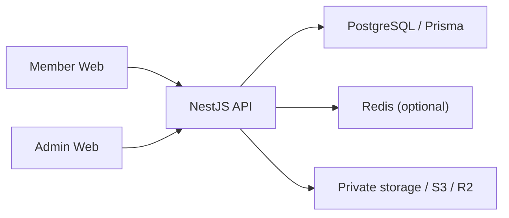

<div align="center">

# ✦ New Web Platform

### แพลตฟอร์มปฏิบัติการสำหรับสมาชิก ระบบการเงิน Provider และทีมแอดมิน

[](https://github.com/tawechok1997-ai/platform-starter/actions/workflows/build.yml)
[](https://github.com/tawechok1997-ai/platform-starter/actions/workflows/smoke.yml)
[](https://github.com/tawechok1997-ai/platform-starter/actions/workflows/e2e-smoke.yml)


<p>
  <a href="README.md">🇬🇧 English</a> ·
  <a href="#-ภาพรวม">ภาพรวม</a> ·
  <a href="#-ความสามารถ">ความสามารถ</a> ·
  <a href="#-เริ่มต้นใช้งาน">เริ่มต้นใช้งาน</a> ·
  <a href="#-สถานะโครงการ">สถานะโครงการ</a>
</p>

</div>

---

## ✦ ภาพรวม

New Web Platform คือ Monorepo ที่พัฒนาด้วย TypeScript ประกอบด้วย Member Web, Admin Web, NestJS API และ PostgreSQL โดยออกแบบมาเพื่อรองรับ:

- การจัดการกระเป๋าเงินและธุรกรรมอย่างตรวจสอบย้อนหลังได้
- ระบบสิทธิ์ Admin แบบละเอียด
- การฝาก ถอน ตรวจสอบรายการ และการทำบัญชี Ledger
- โครงสร้างเชื่อมต่อ Provider แบบมี safety gate
- UX/UI ที่รองรับมือถือ Tablet และ Desktop
- ระบบทดสอบและตรวจสอบก่อนนำขึ้น Production

> **สถานะปัจจุบัน:** ระบบหลักมีโค้ดและ build ผ่านแล้ว ส่วน Provider จริง, visual regression, UX/UI polish และ production hardening ยังอยู่ระหว่างพัฒนา

## ✨ จุดเด่น

| 💳 ระบบการเงิน | 🛡️ ความปลอดภัย Admin | 🎨 UX/UI |
| --- | --- | --- |
| Wallet และ Ledger<br>คิวฝาก/ถอน<br>Idempotency และ Audit | แยก Admin Auth<br>RBAC และ Permission Guard<br>TOTP 2FA และ Recovery Codes | Member แบบ Mobile-first<br>Admin Sidebar บน Desktop<br>Safe-area และ Focus support |

| 🎮 Provider | 📈 การมองเห็นระบบ | 🚦 การเตรียม Release |
| --- | --- | --- |
| Adapter contract<br>Demo/Simulator provider<br>เครื่องมือกู้คืน Transfer | Reports และ Export<br>Activity Timeline<br>Risk และ Readiness panel | Health/Version endpoint<br>Smoke script<br>Backup/Restore |

<details>
<summary><strong>ภาพรวมแต่ละระบบ</strong></summary>

| ระบบ | หน้าที่ | URL สำหรับพัฒนา |
| --- | --- | --- |
| Member Web | ประสบการณ์สมาชิก การเงิน เกม โปรไฟล์ และ Support | `http://localhost:3000` |
| Admin Web | ศูนย์ปฏิบัติการหลังบ้าน | `http://localhost:3001` |
| API | Auth, Wallet, Finance, Provider, Audit และ System API | `http://localhost:4000` |

</details>

## 🧭 Applications

| Application | ตำแหน่ง | หน้าที่ |
| --- | --- | --- |
| Member Web | `apps/web-member` | Login, Wallet, ฝาก, ถอน, เกม, โปรโมชั่น, โปรไฟล์ และประวัติ |
| Admin Web | `apps/web-admin` | Dashboard, Queue, สมาชิก, Ledger, Reports, Risk, Provider และ Security |
| API | `apps/api` | Business logic, Auth, Permission, Finance, Storage และ Audit |
| Database | `prisma/schema.prisma` | โครงสร้าง PostgreSQL และ Prisma Client |

## 🏗️ Architecture



ทั้ง Member และ Admin ใช้ API และ business logic ชุดเดียวกัน แต่แยก Authentication, Permission, Navigation และหน้าที่การใช้งานออกจากกัน

### หลักการออกแบบ

| หลักการ | แนวทางในระบบ |
| --- | --- |
| Business boundary เดียว | Logic การเงินและสิทธิ์อยู่ที่ API |
| Least privilege | Backend guard เป็นผู้ตัดสินสิทธิ์จริง |
| Auditability | Action สำคัญต้องตรวจสอบย้อนหลังได้ |
| Safe retry | ใช้ Idempotency และตรวจ state ก่อน mutation |
| Responsive by intent | Layout แต่ละอุปกรณ์ต่างกันได้โดยไม่ทำซ้ำ business logic |
| Production gates | Provider จริงและเงินจริงต้องผ่าน Preflight/QA ก่อน |

## ✨ ความสามารถ

### Member

- Login, Register, Session Expired และจุดเชื่อมต่อ Anti-bot
- Wallet และยอดเงิน
- ฝากเงินและอัปโหลดสลิป
- ถอนเงินและจัดการบัญชีธนาคาร
- ประวัติรายการ
- Game Lobby และการเปิดเกม
- Promotion และ Bonus
- Profile และ Security
- Notifications
- Support Ticket และ FAQ

### Admin

- Admin Login, Refresh Session และการบังคับใช้ 2FA สำหรับสิทธิ์สูง
- Sidebar ที่แสดงตาม Permission
- คิวตรวจฝากและถอน
- สมาชิก Wallet และ Ledger
- Reports, Export, Risk Alert และ Activity Timeline
- Provider Setup, Preset, Credential และ Endpoint
- Game Transfer Recovery
- Webhook Test และ Reconciliation
- Admin Account, Role, Invitation, Session และ Audit
- Branding, Feature Flag, Maintenance และ Website Settings

## 🧰 Technology

| Layer | เทคโนโลยี |
| --- | --- |
| Frontend | Next.js 14, React 18, TypeScript |
| Backend | NestJS, TypeScript |
| Database | PostgreSQL, Prisma 6 |
| Authentication | JWT Access/Refresh, TOTP 2FA, Recovery Codes |
| Authorization | RBAC และ Permission Guard |
| Storage | Local private storage หรือ S3/R2 |
| Testing | Jest, Playwright, GitHub Actions |
| Deployment | Railway-ready multi-service |

## 📁 โครงสร้างโปรเจกต์

```text
apps/
├── api/                 NestJS API
├── web-admin/           Admin Next.js app
└── web-member/          Member Next.js app

prisma/
├── schema.prisma        Database schema
├── seed.ts              Base seed
├── seed-access.ts       Roles และ permissions
└── seed-games.ts        Game/provider seed

scripts/
├── smoke-api.sh
├── check-health.sh
├── verify-production-env.sh
├── backup-db.sh
└── restore-db.sh

docs/
├── remaining-work-backlog.md
├── ux-ui-master-roadmap.md
├── final-qa-checklist.md
├── production-verification.md
└── security-checklist.md
```

## 🚀 เริ่มต้นใช้งาน

### สิ่งที่ต้องมี

- Node.js 24.x
- pnpm 9.x หรือ version ที่ระบุใน `package.json`
- PostgreSQL 14+
- Redis เป็น optional
- Playwright browser binaries สำหรับ Browser test

### ติดตั้ง

```bash
pnpm install --frozen-lockfile
pnpm prisma generate
```

ตั้งค่าจาก `.env.example` โดยอย่างน้อยต้องมี `DATABASE_URL`, JWT keys และ `NEXT_PUBLIC_API_URL`

### Seed สิทธิ์สำหรับ Development

```bash
pnpm db:seed:access
```

### Start ระบบ

```bash
pnpm --filter @platform/api dev
pnpm --filter @platform/web-member dev
pnpm --filter @platform/web-admin dev
```

## ✅ Build และตรวจสอบ

```bash
# Production builds
pnpm build:api
pnpm build:web-member
pnpm build:web-admin

# API unit tests
pnpm --filter @platform/api exec jest --runInBand

# Permission coverage
pnpm audit:admin-permissions

# Browser smoke และ visual checks
pnpm test:e2e:smoke
pnpm test:e2e:visual
```

### Checkpoint ล่าสุด

| รายการ | สถานะ |
| --- | --- |
| API build | ✅ ผ่าน |
| Admin Web build | ✅ ผ่าน |
| Member Web build | ✅ ผ่าน |
| API Jest | ✅ ผ่าน 50/50 tests |
| Admin permission audit | ✅ ตรวจ 25 controllers |
| Login HTTP smoke | ✅ Member/Admin ได้ HTTP 200 |
| Authenticated visual regression | ⏳ รอ Browser environment และ test accounts |

## 🔐 Environment และความปลอดภัย

ตัวแปรหลักของ API:

```env
DATABASE_URL=postgresql://...
JWT_ACCESS_KEY=change-me
JWT_ACCESS_TTL=15m
JWT_REFRESH_TTL_DAYS=30
ADMIN_JWT_ACCESS_TTL=10m
ADMIN_REFRESH_TTL_HOURS=12
ADMIN_2FA_ENFORCEMENT_ENABLED=true
ADMIN_OTP_ISSUER=New Web Platform
MEMBER_WEB_URL=http://localhost:3000
ADMIN_WEB_URL=http://localhost:3001
```

ห้าม commit secrets จริง, Provider credentials, refresh tokens, recovery codes หรือ production database URL

> **คำเตือนฐานข้อมูล:** ห้ามรัน `pnpm prisma db push --force-reset` กับฐานข้อมูลจริง

## 🗺️ สถานะโครงการ

| ส่วนงาน | สถานะ |
| --- | --- |
| Core API และ Database | ✅ Implemented |
| Member Wallet และ Finance | ✅ Implemented; กำลัง Regression test |
| Admin Operations และ Permission | ✅ Implemented; กำลังตรวจ Edge cases |
| Provider production integration | 🧪 Scaffold/Demo-gated ยังไม่พร้อม Production |
| Notifications และ Support | 🟡 Partial |
| Responsive UX/UI | 🚧 กำลังพัฒนา |
| Authenticated visual regression | ⏳ Pending |
| Production hardening และ Release QA | 🚧 กำลังพัฒนา |

## 📚 เอกสารสำคัญ

| เอกสาร | รายละเอียด |
| --- | --- |
| [`docs/remaining-work-backlog.md`](docs/remaining-work-backlog.md) | สถานะงานจากการ audit และรายการที่เหลือ |
| [`docs/ux-ui-master-roadmap.md`](docs/ux-ui-master-roadmap.md) | Roadmap UX/UI และ Definition of Done |
| [`docs/final-qa-checklist.md`](docs/final-qa-checklist.md) | Final QA checklist |
| [`docs/mobile-visual-regression-checklist.md`](docs/mobile-visual-regression-checklist.md) | ตรวจสอบหน้าจอมือถือ |
| [`docs/production-verification.md`](docs/production-verification.md) | ตรวจสอบก่อนขึ้น Production |
| [`docs/security-checklist.md`](docs/security-checklist.md) | Security hardening checklist |
| [`docs/reports-analytics.md`](docs/reports-analytics.md) | Reports, Aging และ CSV export |
| [`docs/activity-timeline.md`](docs/activity-timeline.md) | Activity และ Audit timeline |

## License

โปรเจกต์ Private/Internal — ควรเพิ่ม License ที่ชัดเจนก่อนเผยแพร่สู่สาธารณะ
